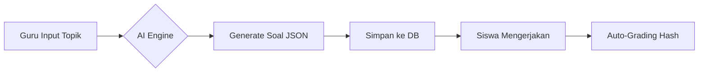
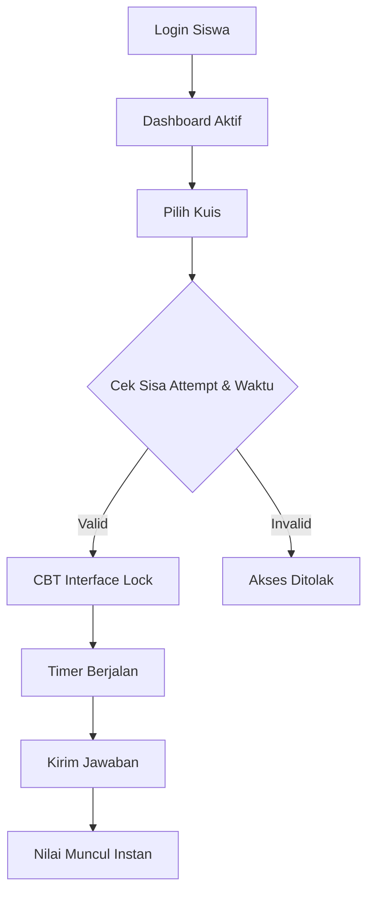

# PSSM - Powered Smart School Management 🚀
### "Empowering Education with Artificial Intelligence & Enterprise Security"

[](https://opensource.org/licenses/MIT)
[](https://laravel.com)
[](https://ai.google.dev/)
[](https://github.com/kazanaru/pssm)

---

## 📖 Jurnal Proyek & Visi
**Kazanaru** menghadirkan **PSSM**, sebuah ekosistem manajemen sekolah modern yang dirancang untuk menjawab tantangan digitalisasi pendidikan di Indonesia. Fokus utama kami adalah efisiensi operasional guru dan keamanan data siswa yang tidak dapat dikompromi.

### **Problem Statement**
Institusi pendidikan saat ini seringkali terjebak dalam tumpukan kertas (Paper-based) dan sistem digital yang kaku. Guru kehilangan waktu berharga untuk mengoreksi esai secara manual atau membuat bank soal. PSSM hadir untuk mengotomatisasi hal tersebut.

---

## 🗺️ Roadmap Pengembangan (Roadmap)

### **Fase 1: Fondasi & MVP (Current ✅)**
- [x] Arsitektur Multi-role (Admin, Guru, Siswa).
- [x] Sistem Manajemen Kelas & Akademik.
- [x] AI Quiz Generator (Multiple Choice).
- [x] AI Essay Feedback (Analisis Naratif).
- [x] Export Rapor PDF & Data CSV.

### **Fase 2: Interaksi & Mobilitas (Q3 2026 🔜)**
- [ ] Integrasi WhatsApp Gateway (Fonnte) untuk notifikasi tugas.
- [ ] Progressive Web App (PWA) untuk akses offline ringan.
- [ ] Modul Pembayaran SPP Digital.

### **Fase 3: Smart Analytics (Q4 2026 🔜)**
- [ ] AI Predictive Analytics (Deteksi dini siswa yang berisiko tertinggal).
- [ ] Parent Portal Mobile App.

---

## 🛠️ Alur Kerja (Workflow)

### **1. Workflow Guru (Pembuatan Kuis AI)**


### **2. Workflow Siswa (Ujian CBT)**


---

## 🏗️ Arsitektur Keamanan (Security Architecture)

PSSM menggunakan pendekatan **Security-by-Design**:
1.  **Hashed Integrity:** Seluruh kunci jawaban kuis tidak disimpan dalam teks biasa, melainkan melalui proses **Bcrypt Hashing**. Kebocoran database tidak akan membocorkan jawaban.
2.  **Private Vault:** File lampiran tugas disimpan di folder `storage/app/private` yang hanya bisa diakses melalui *Signed Route* Laravel setelah melewati middleware otentikasi.
3.  **Role-Based Access Control (RBAC):** Implementasi ketat menggunakan Spatie, memastikan siswa tidak memiliki celah untuk menyuntikkan data ke modul guru.

---

## 📊 Flowchart Detail Sistem

### **Sistem Absensi Digital**
1.  **Mulai:** Guru/Ketua Kelas membuka modul absensi.
2.  **Pilih:** Memilih Kelas, Mata Pelajaran, dan Tanggal.
3.  **Input:** Menandai status (Hadir, Izin, Sakit, Alpa).
4.  **Simpan:** Data masuk ke tabel `attendances` dengan log penginput.
5.  **Audit:** Super Admin dapat melihat riwayat perubahan data absensi.

---

## 🚀 Panduan Instalasi Profesional

### **Persyaratan Sistem**
- PHP 8.3 or higher
- PostgreSQL 16 or SQLite
- Node.js 20+
- Redis (Optional for caching)

### **Instalasi Cepat**
```bash
# Clone
git clone https://github.com/kazanaru/pssm.git && cd pssm

# Backend
composer install
cp .env.example .env
php artisan key:generate

# Database
php artisan migrate --seed

# Frontend (Shadcn Style)
npm install
npm run build

# Start
php artisan serve
```

---

## 📜 Dokumen Pendukung (Project Documents)
- [Tata Tertib Kode (Code of Conduct)](CODE_OF_CONDUCT.md)
- [Panduan Kontribusi (Contributing)](CONTRIBUTING.md)
- [Kebijakan Keamanan (Security Policy)](SECURITY.md)
- [Lisensi MIT](LICENSE)

---

## 🤝 Kontribusi & Dukungan
Proyek ini bersifat open-source. Kami menyambut kontributor yang ingin membantu memajukan pendidikan digital. Silakan buat *Pull Request* atau ajukan *Issue* jika menemukan bug.

---
**Copyright © 2026 Kazanaru.**  
*Built with ❤️ for better Indonesian Education.*
