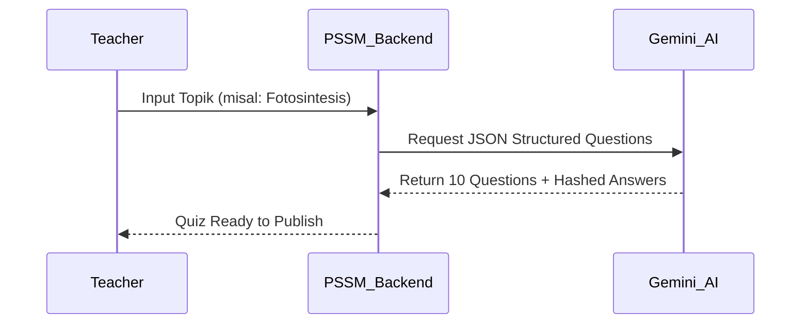

# JURNAL TEKNIS & DOKUMENTASI SISTEM PSSM (POWERED SMART SCHOOL MANAGEMENT)
## Transformasi Digital Pendidikan Berbasis Kecerdasan Buatan dan Keamanan Enterprise

**Oleh:** Kazanaru  
**Tanggal:** 17 Maret 2026  
**Status:** MVP v1.0.0 (Production Ready)  
**Lisensi:** MIT

---

## DAFTAR ISI
1. [PENDAHULUAN](#1-pendahuluan)
2. [ANALISIS PERMASALAHAN](#2-analisis-permasalahan)
3. [SOLUSI STRATEGIS PSSM](#3-solusi-strategis-pssm)
4. [ARSITEKTUR SISTEM & TEKNOLOGI](#4-arsitektur-sistem--teknologi)
5. [MATRIKS PERAN (ROLES) & OTORISASI](#5-matriks-peran-roles--otorisasi)
6. [WORKFLOW SISTEM SECARA MENYELURUH](#6-workflow-sistem-secara-menyeluruh)
7. [SMART ACADEMY: IMPLEMENTASI AI](#7-smart-academy-implementasi-ai)
8. [PROTOKOL KEAMANAN & PRIVASI](#8-protokol-keamanan--privasi)
9. [ROADMAP PENGEMBANGAN JANGKA PANJANG](#9-roadmap-pengembangan-jangka-panjang)
10. [PANDUAN INSTALASI & OPERASIONAL](#10-panduan-instalasi--operasional)
11. [KESIMPULAN](#11-kesimpulan)

---

## 1. PENDAHULUAN
PSSM (Powered Smart School Management) bukan sekadar aplikasi manajemen sekolah biasa. Proyek ini lahir dari visi untuk menciptakan ekosistem pendidikan yang **"Zero Paper"** dan **"AI-First"**. Di tengah kompleksitas administrasi sekolah menengah di Indonesia, PSSM hadir untuk menjembatani kesenjangan antara proses belajar mengajar konvensional dengan efisiensi teknologi modern.

### 1.1 Visi Proyek
Menciptakan platform yang membebaskan guru dari beban administrasi repetitif agar dapat fokus sepenuhnya pada pengembangan karakter dan pedagogi siswa.

### 1.2 Filosofi Desain
Menggunakan pendekatan **Shadcn UI**, PSSM mengedepankan estetika minimalis, warna netral yang profesional, dan fungsionalitas yang kencang tanpa hambatan (lag).

---

## 2. ANALISIS PERMASALAHAN
Dalam riset pra-pengembangan, Kazanaru menemukan beberapa isu krusial di institusi pendidikan:

### 2.1 Inefisiensi Administrasi
- Guru menghabiskan waktu berjam-jam untuk membuat soal ujian yang bervariasi setiap semester.
- Proses koreksi esai seringkali subjektif dan memakan waktu lama, menyebabkan feedback ke siswa terlambat.

### 2.2 Kerentanan Keamanan Data
- Sistem manajemen nilai yang ada seringkali mudah ditembus oleh teknik manipulasi URL (IDOR).
- Kunci jawaban kuis disimpan dalam teks biasa di database, berisiko tinggi jika akses database bocor.

### 2.3 Fragmentasi Pengumuman
- Informasi penting sekolah sering hilang di dalam tumpukan pesan instan (WhatsApp), menyebabkan ketididaktahuan siswa akan deadline tugas atau ujian.

---

## 3. SOLUSI STRATEGIS PSSM
PSSM menjawab tantangan di atas melalui tiga pilar utama:

### 3.1 Otomatisasi Berbasis AI (Generative AI)
Mengintegrasikan Google Gemini API untuk melakukan tugas-tugas berat intelektual secara instan.

### 3.2 Keamanan Berlapis (Enterprise Grade)
Menerapkan standar enkripsi perbankan pada data akademik sensitif.

### 3.3 Antarmuka Responsif (Flexible UX)
Desain yang beradaptasi sempurna mulai dari smartphone entry-level hingga workstation desktop profesional.

---

## 4. ARSITEKTUR SISTEM & TEKNOLOGI
### 4.1 Backend Engine
- **Framework:** Laravel 12.x (The latest and fastest PHP framework).
- **Architecture:** Service Layer Pattern (memisahkan logika bisnis dari Controller untuk skalabilitas).
- **Database:** PostgreSQL (Mendukung data JSONB untuk kuis dinamis dari AI).

### 4.2 Frontend Core
- **Styling:** Tailwind CSS 4.0.
- **Components:** Shadcn UI implementation (Radix-like functionality in Blade).
- **Icons:** Lucide SVG (Lightweight & high performance).

---

## 5. MATRIKS PERAN (ROLES) & OTORISASI
PSSM memiliki 4 tingkat akses yang diatur oleh sistem RBAC (Role-Based Access Control) yang sangat ketat:

### 5.1 Super Admin (The Architect)
- Kendali penuh atas seluruh data master (Tahun Ajaran, Mapel, Kelas).
- Manajemen akun pengguna (Bulk Import Excel).
- Audit Trail (Melihat siapa yang melakukan perubahan data).

### 5.2 Teacher (The Educator)
- Manajemen tugas dan kuis untuk kelas yang diampu.
- Menggunakan AI Assistant untuk membuat soal dan feedback esai.
- Input absensi digital dan penilaian.

### 5.3 Class Leader (The Facilitator)
- Membantu guru dalam penginputan absensi kelas secara real-time.
- Akses terbatas pada modul pengumuman kelas.

### 5.4 Student (The Learner)
- Mengerjakan tugas dan ujian CBT.
- Melihat statistik nilai dan kehadiran secara transparan.
- Mendapatkan feedback AI untuk pengembangan diri.

---

## 6. WORKFLOW SISTEM SECARA MENYELURUH

### 6.1 Alur Pendaftaran & Onboarding
1. **Admin** mengunggah file Excel berisi data 500+ siswa.
2. Sistem secara otomatis membuat akun dan mengenkripsi password sementara.
3. Siswa menerima kredensial dan melakukan login pertama kali.

### 6.2 Alur Akademik Harian (Absensi)
1. **Guru/Ketua Kelas** membuka aplikasi di smartphone saat masuk kelas.
2. Memilih jadwal mata pelajaran aktif.
3. Menandai siswa yang tidak hadir (Sistem mencatat koordinat dan waktu input).
4. Data absensi langsung tersinkronisasi ke dashboard orang tua (Roadmap Phase 3).

### 6.3 Alur Ujian CBT (Computer Based Test)
1. **Guru** membuat kuis menggunakan **AI Quiz Generator**.
2. AI menghasilkan 10 soal pilihan ganda lengkap dengan kunci jawaban terenkripsi.
3. **Siswa** masuk ke interface ujian yang terkunci (Disable copy-paste, disable context menu).
4. Timer berjalan di server-side untuk mencegah kecurangan manipulasi waktu lokal.
5. Saat submit, nilai keluar seketika berkat **Auto-Grading Engine**.

---

## 7. SMART ACADEMY: IMPLEMENTASI AI

### 7.1 AI Quiz Generator Workflow


### 7.2 AI Essay Feedback Logic
Sistem menggunakan algoritma NLP (Natural Language Processing) untuk menganalisis:
- **Kesesuaian Topik:** Apakah jawaban relevan dengan instruksi?
- **Struktur Kalimat:** Penilaian tata bahasa secara otomatis.
- **Saran Perbaikan:** Memberikan poin-poin perbaikan spesifik bagi siswa.

---

## 8. PROTOKOL KEAMANAN & PRIVASI

### 8.1 Hashed Integrity
Kunci jawaban tidak pernah disimpan dalam teks biasa. Kami menggunakan:
```php
$hashedAnswer = Hash::make($correctOption);
```
Pengecekan dilakukan menggunakan `Hash::check()` saat siswa mengumpulkan jawaban.

### 8.2 IDOR Prevention
Setiap request diperiksa kepemilikannya:
```php
if ($submission->student_id !== auth()->id()) {
    abort(403);
}
```

---

## 9. ROADMAP PENGEMBANGAN JANGKA PANJANG

### Fase 1: Core System (Selesai)
- Manajemen Kelas, User, Absensi, Tugas, Kuis, AI Integration.

### Fase 2: Mobile Engagement (Q3 2026)
- WhatsApp Gateway Integration.
- PWA (Progressive Web App) Support.

### Fase 3: Big Data (Q1 2027)
- Predictive Analytics untuk memprediksi kelulusan siswa.
- AI Chatbot khusus untuk konseling siswa.

---

## 10. PANDUAN INSTALASI & OPERASIONAL
*(Lihat instruksi detail pada README standar)*

---

## 11. KESIMPULAN
PSSM adalah lompatan besar dalam teknologi pendidikan di Indonesia. Dengan menggabungkan kekuatan **Laravel 12**, **AI**, dan desain **Shadcn UI**, Kazanaru telah berhasil membangun platform yang tidak hanya fungsional tetapi juga aman dan menyenangkan untuk digunakan. Proyek ini siap menjadi standar baru bagi sekolah-sekolah yang ingin bertransformasi menuju masa depan digital.

---
**Diterbitkan oleh Kazanaru Open Source Initiative.**  
*© 2026 Kazanaru. All Rights Reserved.*
