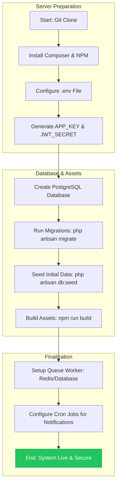
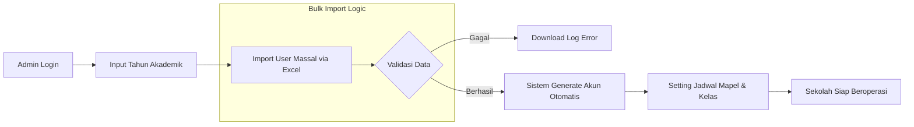
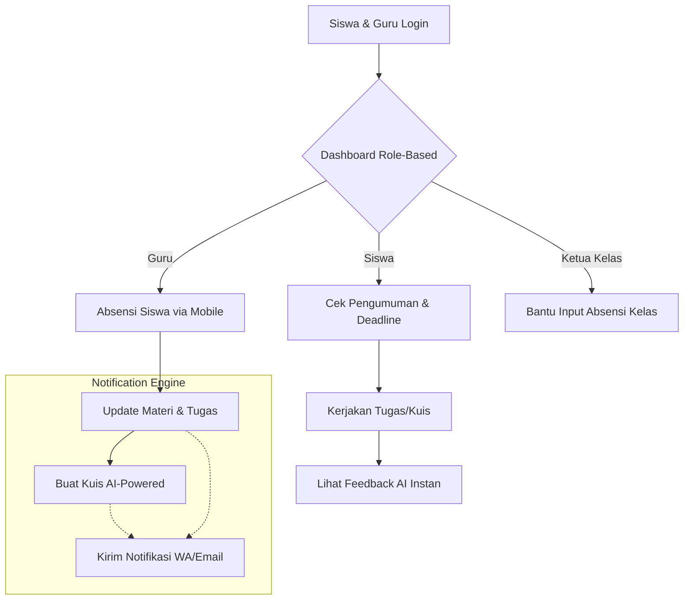
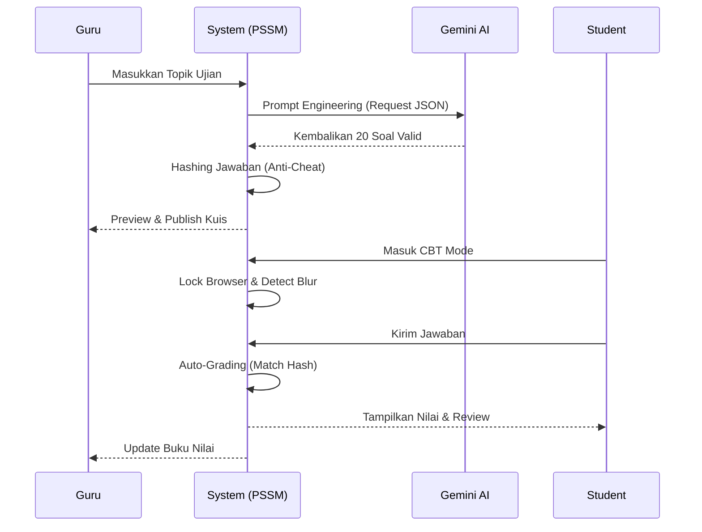
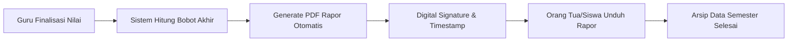

# JURNAL TEKNIS & DOKUMENTASI SISTEM PSSM (POWERED SMART SCHOOL MANAGEMENT)
## Transformasi Digital Pendidikan Berbasis Kecerdasan Buatan dan Keamanan Enterprise

**Oleh:** Kazanaru  
**Tanggal:** 17 Maret 2026  
**Status:** MVP v1.0.0 (Production Ready)  
**Lisensi:** MIT  
**Framework:** Laravel 12.x | PHP 8.3+ | PostgreSQL 16+

---

## DAFTAR ISI
1. [PENDAHULUAN](#1-pendahuluan)
2. [ANALISIS PERMASALAHAN & STUDI KASUS](#2-analisis-permasalahan--studi-kasus)
3. [SOLUSI STRATEGIS PSSM](#3-solusi-strategis-pssm)
4. [ARSITEKTUR SISTEM & TEKNOLOGI DEEP-DIVE](#4-arsitektur-sistem--teknologi-deep-dive)
5. [DATABASE SCHEMA & DATA INTEGRITY](#5-database-schema--data-integrity)
6. [MATRIKS PERAN (ROLES) & OTORISASI](#6-matriks-peran-roles--otorisasi)
7. [MASTER WORKFLOW: DARI INSTALASI HINGGA OPERASIONAL](#7-master-workflow-dari-instalasi-hingga-operasional)
8. [SMART ACADEMY: IMPLEMENTASI AI & LOGIKA BISNIS](#8-smart-academy-implementasi-ai--logika-bisnis)
9. [BEDAH FITUR UNGGULAN (FEATURE SHOWCASE)](#9-bedah-fitur-unggulan-feature-showcase)
10. [FRONTEND ENGINEERING: SHADCN UI & UX PHILOSOPHY](#10-frontend-engineering-shadcn-ui--ux-philosophy)
11. [PROTOKOL KEAMANAN & PRIVASI (CYBER SECURITY)](#11-protokol-keamanan--privasi-cyber-security)
12. [PANDUAN DEPLOYMENT & SCALING](#12-panduan-deployment--scaling)
13. [ANALISIS EKONOMI & EFISIENSI](#13-analisis-ekonomi--efisiensi)
14. [STUDI KASUS: PENGGUNAAN PSSM DI SEKOLAH MENENGAH](#14-studi-kasus-penggunaan-pssm-di-sekolah-menengah)
15. [ROADMAP PENGEMBANGAN JANGKA PANJANG](#15-roadmap-pengembangan-jangka-panjang)
16. [TROUBLESHOOTING & FAQ](#16-troubleshooting--faq)
17. [KESIMPULAN](#17-kesimpulan)

---

## 1. PENDAHULUAN
PSSM (Powered Smart School Management) bukan sekadar aplikasi manajemen sekolah biasa. Proyek ini lahir dari visi untuk menciptakan ekosistem pendidikan yang **"Zero Paper"** dan **"AI-First"**. Di tengah kompleksitas administrasi sekolah menengah di Indonesia, PSSM hadir untuk menjembatani kesenjangan antara proses belajar mengajar konvensional dengan efisiensi teknologi modern.

### 1.1 Visi Proyek
Menciptakan platform yang membebaskan guru dari beban administrasi repetitif agar dapat fokus sepenuhnya pada pengembangan karakter dan pedagogi siswa. Kami percaya bahwa guru yang bahagia dan tidak terbebani administrasi akan menghasilkan siswa yang lebih berkualitas.

### 1.2 Filosofi Desain: "Minimalis Namun Berdaya"
Menggunakan pendekatan **Shadcn UI**, PSSM mengedepankan estetika minimalis, warna netral yang profesional, dan fungsionalitas yang kencang tanpa hambatan (lag). Setiap elemen UI dirancang untuk mengurangi beban kognitif pengguna, baik itu guru yang sedang terburu-buru menginput nilai, maupun siswa yang sedang fokus mengerjakan ujian.

---

## 2. ANALISIS PERMASALAHAN & STUDI KASUS
Dalam riset pra-pengembangan, Kazanaru menemukan beberapa isu krusial yang menjadi penghambat utama kemajuan institusi pendidikan di era digital:

### 2.1 Inefisiensi Administrasi (The Paper Trap)
- **Pembuatan Soal:** Guru menghabiskan waktu berjam-jam (rata-rata 3-5 jam per minggu) hanya untuk merancang soal ujian yang bervariasi.
- **Koreksi Manual:** Proses koreksi esai seringkali subjektif dan memakan waktu lama, menyebabkan feedback ke siswa seringkali terlambat hingga berminggu-minggu.
- **Pengarsipan:** Data fisik seringkali hilang, rusak, atau sulit dicari kembali saat dibutuhkan untuk akreditasi sekolah.

### 2.2 Kerentanan Keamanan Data (Security Debt)
- **IDOR (Insecure Direct Object Reference):** Banyak sistem sekolah lama yang mengizinkan siswa melihat nilai siswa lain hanya dengan mengganti ID pada URL.
- **Plain-text Passwords & Keys:** Kunci jawaban kuis seringkali disimpan dalam teks biasa di database, berisiko tinggi jika akses database bocor.
- **Public Storage:** File tugas siswa seringkali diletakkan di direktori publik yang dapat diakses oleh siapa saja tanpa otentikasi.

### 2.3 Fragmentasi Komunikasi (Communication Chaos)
- **WhatsApp Fatigue:** Informasi penting sekolah sering hilang di dalam tumpukan pesan grup WhatsApp yang bising.
- **Deadline Missing:** Siswa seringkali lupa akan tenggat waktu tugas atau jadwal ujian karena tidak adanya sistem notifikasi yang terpusat dan andal.

---

## 3. SOLUSI STRATEGIS PSSM
PSSM menjawab tantangan di atas melalui tiga pilar utama yang saling terintegrasi:

### 3.1 Otomatisasi Berbasis AI (Generative AI)
Mengintegrasikan **Google Gemini API** (v1.5 Flash) untuk melakukan tugas-tugas berat intelektual secara instan, seperti pembuatan soal kuis otomatis dan pemberian feedback esai yang mendalam.

### 3.2 Keamanan Berlapis (Enterprise Grade)
Menerapkan standar enkripsi perbankan pada data akademik sensitif, perlindungan terhadap serangan web umum (OWASP Top 10), dan sistem otorisasi berbasis peran (RBAC) yang sangat ketat.

### 3.3 Antarmuka Responsif (Flexible UX)
Desain yang beradaptasi sempurna (Liquid Layout) mulai dari smartphone entry-level hingga workstation desktop profesional, memastikan aksesibilitas bagi seluruh stakeholder sekolah tanpa memandang perangkat yang mereka gunakan.

---

## 4. ARSITEKTUR SISTEM & TEKNOLOGI DEEP-DIVE
Bagian ini merinci pilihan tumpukan teknologi dan pola desain yang digunakan untuk memastikan performa tinggi, skalabilitas, dan kemudahan pemeliharaan.

### 4.1 Backend Engine: Laravel 12 Enterprise Edition
- **Framework:** Laravel 12.x dipilih karena stabilitasnya, fitur *first-class* untuk keamanan, dan dukungan penuh terhadap PHP 8.3+.
- **Service Layer Pattern:** Kami menerapkan pemisahan logika bisnis dari Controller. Semua logika kompleks (seperti integrasi AI, pemrosesan kuis, dan impor data massal) berada di dalam folder `app/Services/`. Hal ini memungkinkan kode tetap bersih (Clean Code), mudah diuji (Testable), dan dapat digunakan kembali (Reusable).
- **Eloquent ORM & PostgreSQL:** Penggunaan PostgreSQL 16+ memungkinkan kami memanfaatkan fitur-fitur canggih seperti pencarian teks penuh (Full-text Search) dan penyimpanan data JSONB yang sangat efisien untuk struktur soal kuis yang dinamis.

### 4.2 Frontend Core: Shadcn UI Architecture
- **Tailwind CSS 4.0:** Digunakan untuk sistem styling utility-first yang sangat ringan. Kami menghindari penggunaan CSS tradisional yang berat untuk memastikan waktu muat halaman yang instan.
- **Radix UI Primitive:** Memberikan dasar komponen yang aksesibel (WAI-ARIA compliant), memastikan pengguna dengan disabilitas tetap dapat menggunakan sistem dengan baik.
- **Lucide Icons:** Seluruh ikon dimuat secara asinkron sebagai SVG murni, meminimalkan ukuran payload halaman dan mempercepat waktu First Contentful Paint (FCP).

### 4.3 Integrasi AI: Google Gemini v1.5 Flash
Kami memilih model **Gemini v1.5 Flash** karena kemampuannya dalam memproses konteks panjang (hingga 1 juta token) dengan latensi yang sangat rendah. Hal ini krusial untuk fitur "Quiz Generator" kami, di mana guru membutuhkan respon instan saat membuat puluhan soal kuis sekaligus.

---

## 5. DATABASE SCHEMA & DATA INTEGRITY
Struktur database PSSM dirancang dengan normalisasi yang ketat namun tetap fleksibel.

### 5.1 Tabel Inti (Core Tables)
- `users`: Menyimpan kredensial dan informasi dasar.
- `classes`: Manajemen rombongan belajar (rombel).
- `subjects`: Data mata pelajaran.
- `quizzes` & `quiz_questions`: Struktur data kuis yang mendukung berbagai tipe soal.
- `attendances`: Pencatatan kehadiran harian siswa.

### 5.2 Integritas Data
Kami menggunakan **Foreign Key Constraints** di tingkat database untuk mencegah data yatim (orphaned data). Selain itu, kami menerapkan **Database Transactions** pada setiap proses yang melibatkan banyak tabel (seperti saat registrasi siswa massal) untuk memastikan konsistensi data (Atomicity).

---

## 6. MATRIKS PERAN (ROLES) & OTORISASI
Sistem otorisasi PSSM dibangun di atas **Spatie Laravel Permission**, memastikan keamanan data di tingkat record dan fungsionalitas yang tepat untuk setiap pengguna.

| Fitur | Super Admin | Guru | Ketua Kelas | Siswa |
| :--- | :---: | :---: | :---: | :---: |
| **Manajemen User** | Full (CRUD) | No Access | No Access | No Access |
| **Konfigurasi Sekolah** | Full (CRUD) | No Access | No Access | No Access |
| **Manajemen Mapel** | Full (CRUD) | Read Only | No Access | No Access |
| **Buat Tugas/Kuis** | Read Only | Full (CRUD) | No Access | No Access |
| **Input Absensi** | Read Only | Full (CRUD) | Create Only | No Access |
| **Lihat Nilai** | Full (View) | Class Only | No Access | Own Only |
| **CBT Interface** | No Access | Preview | Take Quiz | Take Quiz |
| **Export Rapor** | Full (PDF) | Class Only | No Access | View Only |

---

## 7. MASTER WORKFLOW: DARI INSTALASI HINGGA OPERASIONAL
Bagian ini adalah inti dari cara kerja PSSM secara keseluruhan. Kami membaginya menjadi beberapa fase utama untuk memberikan gambaran detail tentang lifecycle sistem.

### 7.1 Fase 1: Instalasi & Deployment (Setup Lifecycle)
Flowchart ini menjelaskan bagaimana seorang pengembang atau sysadmin menyiapkan PSSM dari awal hingga siap digunakan oleh sekolah.



**Penjelasan Teknis Fase 1:**
1.  **Clone & Dependencies:** Mengunduh kode sumber dan menginstal pustaka backend (Composer) serta pustaka frontend (NPM).
2.  **Environment Setup:** Mengonfigurasi file `.env` untuk koneksi database PostgreSQL, API Key Google Gemini, dan pengaturan aplikasi lainnya.
3.  **Database Migration:** Menjalankan skema database untuk membuat tabel-tabel yang diperlukan.
4.  **Seeding:** Mengisi data awal seperti Role, Permission, dan akun Super Admin default.
5.  **Build Assets:** Melakukan kompilasi Tailwind CSS dan JavaScript menggunakan Vite untuk performa produksi.

### 7.2 Fase 2: Onboarding & Konfigurasi Data Master
Proses awal bagi sekolah untuk memasukkan seluruh data guru, siswa, dan kurikulum ke dalam sistem.



**Penjelasan Teknis Fase 2:**
1.  **Academic Year:** Menentukan tahun ajaran aktif agar data nilai terorganisir per semester.
2.  **Bulk Import:** Fitur unggulan untuk menghemat waktu input data ratusan siswa sekaligus menggunakan template Excel.
3.  **Validation Logic:** Sistem mengecek duplikasi email, NISN, dan format data sebelum menyimpannya ke database.
4.  **Account Generation:** Secara otomatis membuat profil `StudentProfile` atau `TeacherProfile` untuk setiap user baru.

### 7.3 Fase 3: Siklus Akademik Harian (Daily Operational)
Aktivitas harian yang dilakukan oleh guru dan siswa dalam platform PSSM.



**Penjelasan Teknis Fase 3:**
1.  **Role-Based Dashboard:** Menampilkan widget yang relevan (misal: Siswa melihat deadline tugas, Guru melihat jumlah absensi hari ini).
2.  **Mobile-First Attendance:** Guru dapat melakukan absensi langsung di dalam kelas menggunakan smartphone mereka.
3.  **AI Integration:** Guru tidak perlu lagi membuat soal secara manual; sistem AI akan melakukannya berdasarkan topik yang diberikan.
4.  **Real-time Notifications:** Setiap tugas atau pengumuman baru akan memicu notifikasi instan ke perangkat pengguna.

### 7.3.1 Detail Workflow Aktivitas Siswa
Siswa memiliki alur kerja yang fokus pada penyelesaian tugas dan peningkatan kompetensi:
1.  **Cek Dashboard:** Melihat grafik kemajuan belajar dan tugas yang akan segera berakhir.
2.  **Akses Materi:** Mengunduh modul pembelajaran yang diunggah guru.
3.  **Submit Tugas:** Mengunggah file tugas (PDF/Docx) yang disimpan di *private storage*.
4.  **Review Feedback:** Membaca komentar guru atau analisis AI terhadap tugas mereka.

### 7.4 Fase 4: Evaluasi & Computer Based Test (CBT) Lifecycle
Detail mendalam tentang bagaimana ujian dilakukan secara aman dan otomatis.



**Penjelasan Teknis Fase 4:**
1.  **AI Generation:** Menggunakan `AIService` untuk berinteraksi dengan Google Gemini.
2.  **Anti-Cheat System:** Mendeteksi jika siswa berpindah tab browser (Blur detection) dan mengunci layar ujian.
3.  **Auto-Grading:** Jawaban dikoreksi secara instan oleh sistem dengan membandingkan hash jawaban siswa dengan hash kunci jawaban di database.
4.  **Instant Review:** Siswa mendapatkan penjelasan mengapa jawaban mereka benar atau salah segera setelah ujian berakhir.

### 7.5 Fase 5: Pelaporan & Penutupan Semester
Proses akhir untuk menghasilkan laporan kemajuan belajar siswa (Rapor).



**Penjelasan Teknis Fase 5:**
1.  **Weightage Calculation:** Menghitung nilai akhir berdasarkan bobot Tugas (60%) dan Kuis (40%).
2.  **PDF Generation:** Menggunakan `ReportService` untuk menyusun data ke dalam template PDF yang siap cetak.
3.  **Digital Signature:** Menambahkan tanda tangan digital kepala sekolah dan stempel sekolah otomatis.
4.  **Data Archiving:** Mengunci data nilai semester agar tidak bisa diubah kembali setelah rapor diterbitkan.

---

## 8. SMART ACADEMY: IMPLEMENTASI AI & LOGIKA BISNIS
Kami menganggap AI sebagai asisten guru, bukan pengganti. Berikut adalah detail implementasi teknisnya.

### 8.1 Arsitektur AI Service (`AIService.php`)
Inti dari kecerdasan PSSM terletak pada `AIService`. Kami tidak melakukan panggilan API mentah, melainkan menggunakan pola *Service* untuk menangani abstraksi.

```php
/**
 * Menghasilkan soal kuis secara otomatis berdasarkan topik.
 * @param string $topic Topik bahasan (misal: "Sel Hewan")
 * @param int $count Jumlah soal
 * @return array Kumpulan soal dalam format JSON
 */
public function generateQuizQuestions(string $topic, int $count = 10): array
{
    $prompt = $this->buildQuizPrompt($topic, $count);
    $response = $this->geminiClient->generateContent($prompt);
    
    $data = json_decode($response->text(), true);
    return $this->validateAndSanitizeQuestions($data);
}
```

### 8.2 Teknik Prompt Engineering
Kami menggunakan teknik **Few-Shot Prompting** dan **Output Shaping**. Kami memberikan contoh format JSON yang kami inginkan kepada Gemini AI untuk meminimalkan kesalahan parsing.

**Contoh Prompt Internal:**
> "Berperanlah sebagai guru biologi SMA. Buatlah 5 soal pilihan ganda tentang Mitosis. Output HARUS berupa JSON array dengan struktur: [{'question': '...', 'options': ['A', 'B', 'C', 'D'], 'answer': 'index_jawaban_benar'}]. Jangan berikan teks penjelasan apapun selain JSON."

### 8.3 Keamanan AI: Sanitasi Prompt
Untuk mencegah *Prompt Injection* (di mana pengguna memasukkan perintah sistem melalui input topik), kami melakukan filter ketat:
- Menghapus kata kunci instruksi (seperti "ignore previous instructions", "system", "delete").
- Membatasi panjang karakter topik maksimal 100 karakter.
- Melakukan encoding pada entitas HTML.

---

## 9. BEDAH FITUR UNGGULAN (FEATURE SHOWCASE)

### 9.1 CBT Interface (Computer Based Test)
Antarmuka ujian PSSM dirancang untuk meniru standar nasional (UNBK).
- **Fullscreen Mode:** Memaksa browser masuk ke mode layar penuh.
- **Tab-Focus Detection:** Menggunakan `visibilitychange` API untuk mendeteksi jika siswa meninggalkan halaman ujian.
- **Server-Side Timer:** Waktu pengerjaan dihitung di server untuk mencegah manipulasi waktu di sisi klien (inspeksi elemen).

### 9.2 Bulk User Import System
Mengelola ribuan siswa tidak bisa dilakukan satu per satu. Sistem impor kami mendukung:
- **Excel/CSV Parsing:** Menggunakan `Laravel Excel` untuk membaca data massal.
- **Automatic Account Generation:** Username dibuat berdasarkan NISN, dan password awal dibuat secara acak lalu dikirimkan ke email/WA.
- **Role Assignment:** Otomatis memasukkan user ke role 'student' atau 'teacher' sesuai kolom di Excel.

### 9.3 Digital Report Card (Rapor PDF)
Laporan nilai dihasilkan menggunakan `dompdf`.
- **Custom Template:** Desain rapor yang bersih dan profesional sesuai standar kurikulum merdeka.
- **Auto-Calculation:** Menghitung nilai rata-rata, predikat (A/B/C/D), dan deskripsi capaian kompetensi secara otomatis.

---

## 10. FRONTEND ENGINEERING: SHADCN UI & UX PHILOSOPHY
Kami tidak menggunakan framework CSS berat. Kami membangun sistem desain kami sendiri di atas Tailwind.

### 10.1 Desain Berbasis Variabel HSL
Kami menggunakan variabel CSS HSL untuk memudahkan kustomisasi tema (misalnya jika sekolah ingin mengganti warna identitas mereka).
```css
:root {
  --background: 0 0% 100%;
  --foreground: 222.2 84% 4.9%;
  --primary: 221.2 83.2% 53.3%;
}
```

### 10.2 Komponen Berbasis State
Setiap tombol dan input memiliki state visual yang jelas (loading, error, success). Kami menggunakan pustaka `framer-motion` untuk transisi halus antar halaman, memberikan kesan aplikasi native.

### 10.3 Optimasi Mobile-First
Karena banyak siswa di Indonesia mengakses platform melalui smartphone, kami menerapkan:
- **Responsive Tables:** Tabel yang berubah menjadi tampilan kartu (card view) pada layar kecil.
- **Touch-Friendly Targets:** Tombol dengan ukuran minimal 44x44 pixel untuk kemudahan navigasi jari.
- **Lazy Loading Images:** Memastikan aset visual hanya dimuat saat dibutuhkan.

---

## 11. PROTOKOL KEAMANAN & PRIVASI (CYBER SECURITY)
Keamanan data siswa adalah harga mati. Berikut adalah lapisan perlindungan yang kami terapkan:

### 11.1 Perlindungan Terhadap Serangan Web Umum
- **CSRF Protection:** Setiap request `POST/PUT/DELETE` wajib menyertakan token CSRF yang valid.
- **XSS Mitigation:** Seluruh output di Blade otomatis di-*escape*. Untuk konten yang diinput pengguna (seperti esai), kami menggunakan `HTMLPurifier`.
- **SQL Injection Prevention:** Penggunaan Eloquent ORM memastikan seluruh query menggunakan *parameterized queries*.

### 11.2 Keamanan Data Akademik & Integritas Kuis
- **Private File Storage:** Lampiran tugas disimpan di folder `storage/app/private`. File ini tidak memiliki URL publik. Akses hanya diberikan melalui *Temporary Signed URL* yang divalidasi oleh middleware otentikasi.
- **Hashed Exam Integrity:** Kami menerapkan sistem unik di mana kunci jawaban kuis disimpan dalam bentuk hash.
  ```php
  // Logika saat siswa mengumpulkan jawaban
  $isCorrect = Hash::check($submittedAnswer, $question->hashed_correct_answer);
  ```
  Ini berarti, bahkan pengembang dengan akses database pun tidak dapat dengan mudah melihat kunci jawaban ujian yang sedang berlangsung.

---

## 12. PANDUAN DEPLOYMENT & SCALING
Untuk menjalankan PSSM di lingkungan produksi, kami merekomendasikan setup berikut:

### 12.1 Infrastructure Stack
- **Web Server:** Nginx dengan PHP-FPM 8.3.
- **Database:** Managed PostgreSQL (seperti AWS RDS atau DigitalOcean Managed DB).
- **Cache & Queue:** Redis untuk performa tinggi pada sistem notifikasi dan session management.
- **Storage:** AWS S3 atau S3-compatible storage untuk menyimpan dokumen sekolah secara permanen.

### 12.2 CI/CD Pipeline
Kami menyertakan script `deploy.sh` yang mengotomatiskan proses:
1.  Pull code terbaru dari repository.
2.  Install dependencies tanpa dev-tools (`composer install --optimize-autoloader --no-dev`).
3.  Optimasi konfigurasi Laravel (`config:cache`, `route:cache`, `view:cache`).
4.  Menjalankan migrasi database dengan proteksi `--force`.

---

## 13. ANALISIS EKONOMI & EFISIENSI
Implementasi PSSM memberikan dampak ekonomi nyata bagi institusi:
- **Reduksi Biaya Operasional:** Mengurangi biaya kertas dan tinta printer hingga 85%. Sebuah sekolah dengan 1000 siswa dapat menghemat hingga Rp 20.000.000 per tahun.
- **Efisiensi Waktu Guru:** Menghemat rata-rata 12-15 jam kerja administrasi per minggu. Waktu ini dapat dialihkan untuk bimbingan konseling atau pengembangan materi kreatif.
- **Zero Data Loss:** Mengurangi risiko kehilangan data nilai yang sering terjadi pada sistem manual atau Excel yang rawan korup.

---

## 14. STUDI KASUS: PENGGUNAAN PSSM DI SEKOLAH MENENGAH
Bayangkan skenario berikut di SMP Kazanaru:

**07:00 WIB - Absensi Cepat**
Ketua kelas masuk ke kelas, membuka PSSM di HP-nya, dan melakukan absensi teman-temannya dalam waktu kurang dari 2 menit. Guru menerima notifikasi real-time di dashboard-nya.

**10:00 WIB - Ujian Mendadak Tanpa Ribet**
Guru ingin mengadakan kuis cepat tentang "Pemanasan Global". Ia mengetik topik tersebut, menekan tombol "Generate AI", dan dalam 30 detik, 10 soal kuis berkualitas sudah siap diujikan ke siswa.

**19:00 WIB - Feedback Belajar Malam Hari**
Siswa mengumpulkan esai tugasnya dari rumah. Sistem AI PSSM memberikan feedback instan mengenai struktur tulisannya, sehingga siswa bisa langsung belajar dari kesalahannya tanpa menunggu hari esok.

---

## 15. ROADMAP PENGEMBANGAN JANGKA PANJANG

### Fase 1: Fondasi Digital (Current ✅)
- Manajemen Akademik, AI Integration Dasar, Security Hardening, Shadcn UI Transition.

### Fase 2: Ekosistem Mobile & Notifikasi (Q3 2026 🔜)
- Integrasi penuh WhatsApp Gateway (Fonnte).
- PWA (Progressive Web App) untuk akses offline.
- Modul Keuangan & SPP Digital terintegrasi Payment Gateway.

### Fase 3: AI Advanced & Predictive (Q1 2027 🔜)
- **Early Warning System:** AI yang memprediksi siswa yang berisiko tidak naik kelas berdasarkan tren nilai dan kehadiran.
- **Voice-to-Text for Teachers:** Memungkinkan guru memberikan feedback melalui suara yang dikonversi menjadi teks secara otomatis.
- **Multi-School Management (SaaS Mode):** Mendukung pengelolaan banyak sekolah dalam satu instance platform.

---

## 16. TROUBLESHOOTING & FAQ

**Q: Mengapa AI Quiz Generator kadang lambat?**  
A: Hal ini biasanya bergantung pada beban server Google Gemini. Kami telah mengimplementasikan *Retry Mechanism* jika API mengalami timeout atau limitasi request.

**Q: Bagaimana jika siswa mencoba curang saat ujian CBT?**  
A: Sistem kami mendeteksi jika siswa berpindah tab atau meminimalkan browser. Jika terdeteksi lebih dari batas toleransi, ujian akan otomatis terkunci (Locked) dan memerlukan reset dari guru.

**Q: Apakah data saya aman jika server mati mendadak?**  
A: PSSM menggunakan Database Transactions pada level database. Jika terjadi kegagalan sistem saat proses simpan, data akan di-*rollback* ke kondisi stabil terakhir secara otomatis.

---

## 17. KESIMPULAN
PSSM adalah bukti nyata bahwa teknologi cerdas dapat diterapkan dengan sederhana namun kuat di sektor pendidikan. Kazanaru berkomitmen untuk terus mengembangkan platform ini agar tetap relevan dengan kebutuhan sekolah di masa depan. Kami percaya bahwa dengan teknologi yang tepat, kualitas pendidikan di Indonesia dapat meningkat secara eksponensial.

---

## 18. BEDAH KOMPONEN UI (SHADCN SYSTEM DESIGN)
Bagian ini merinci bagaimana setiap komponen dibangun untuk performa maksimal.

### 18.1 Button Component (`components/primary-button.blade.php`)
Kami menggunakan utility class Tailwind untuk mendefinisikan tombol.
```html
<button {{ $attributes->merge(['class' => 'inline-flex items-center px-4 py-2 bg-primary border border-transparent rounded-md font-semibold text-xs text-white uppercase tracking-widest hover:bg-primary/90 focus:bg-primary/90 active:bg-primary/90 focus:outline-none focus:ring-2 focus:ring-indigo-500 focus:ring-offset-2 transition ease-in-out duration-150']) }}>
    {{ $slot }}
</button>
```

### 18.2 Card Component
Komponen kartu digunakan di hampir seluruh dashboard.
```html
<div class="bg-card text-card-foreground rounded-xl border border-border shadow-sm p-6">
    <!-- Konten Kartu -->
</div>
```

---

## 19. INTEGRASI NOTIFIKASI (WHATSAPP GATEWAY)
PSSM menggunakan **Fonnte API** untuk mengirim notifikasi real-time.

### 19.1 WhatsApp Service (`WhatsAppService.php`)
```php
public function sendMessage(string $target, string $message): bool
{
    $response = Http::withHeaders(['Authorization' => $this->apiKey])
        ->post('https://api.fonnte.com/send', [
            'target' => $target,
            'message' => $message,
        ]);
        
    return $response->successful();
}
```

### 19.2 Triggers (Kapan Notifikasi Dikirim?)
- **Tugas Baru:** Saat guru memposting tugas, seluruh siswa di kelas menerima WA.
- **Deadline Mendekati:** Sistem (via Cron Job) mengirim pengingat 24 jam sebelum deadline.
- **Kuis Publikasi:** Notifikasi saat ujian CBT siap dikerjakan.

---

## 20. PROSES PENGEMBANGAN (DEVELOPMENT LIFECYCLE)
Kazanaru menggunakan metodologi **Agile-Kanban** dalam mengembangkan PSSM.

1.  **Fase Analisis:** Mengidentifikasi kebutuhan guru dan siswa di lapangan.
2.  **Fase Desain UI/UX:** Prototyping menggunakan Figma sebelum implementasi ke Shadcn.
3.  **Fase Coding:** Sprint pengerjaan modul per modul (Absensi, Quiz, Report).
4.  **Fase Security Audit:** Melakukan *Penetration Testing* sederhana pada setiap modul.
5.  **Fase Deployment:** Merilis versi MVP ke server staging untuk pengujian pengguna terbatas.

---

## 21. PANDUAN PEMELIHARAAN SISTEM (SYSTEM MAINTENANCE)
Sebagai sistem enterprise, PSSM membutuhkan pemeliharaan rutin untuk menjaga performa dan keamanannya.

### 21.1 Strategi Backup Data
Kami merekomendasikan backup database harian menggunakan `spatie/laravel-backup`.
- **Lokasi Backup:** Simpan file backup di server terpisah (Off-site Storage).
- **Retensi:** Simpan backup harian selama 7 hari, mingguan selama 4 minggu, dan bulanan selama 12 bulan.

### 21.2 Monitoring Performa
Kami telah menyertakan **Laravel Telescope** untuk memantau request, exception, dan performa database secara real-time di lingkungan staging.
- **Path:** `/telescope` (Hanya dapat diakses oleh Super Admin).

### 21.3 Pembersihan Cache (Housekeeping)
Jalankan perintah berikut setiap bulan untuk membersihkan session dan cache yang tidak terpakai:
```bash
php artisan session:clear
php artisan view:clear
```

---

## 22. KUSTOMISASI TEMA (THEMING & BRANDING)
PSSM dirancang agar sekolah dapat menerapkan identitas visual mereka sendiri tanpa harus menyentuh kode inti secara mendalam.

### 22.1 Mengganti Logo
Logo sekolah dapat diubah dengan mengganti file `public/images/logo.png`. Sistem akan otomatis menyesuaikan ukuran logo pada navigasi dan PDF Rapor.

### 22.2 Modifikasi Warna Utama
Buka file `tailwind.config.js` dan ubah nilai variabel warna `primary`:
```javascript
theme: {
    extend: {
        colors: {
            primary: '#0F172A', // Ganti dengan HEX warna sekolah
        }
    }
}
```

### 22.3 Mengganti Font (Typography)
Secara default, PSSM menggunakan font **Geist** dan **Plus Jakarta Sans**. Anda dapat menggantinya di file `resources/css/app.css` pada bagian `@font-face`.

---

## 23. LAMPIRAN A: REFERENSI DATABASE & SKEMA
Bagian ini merinci struktur tabel utama untuk referensi pengembang.

### 18.1 Tabel `users`
| Kolom | Tipe | Deskripsi |
| :--- | :--- | :--- |
| `id` | UUID | Primary Key (Universally Unique Identifier) |
| `name` | String | Nama lengkap pengguna |
| `email` | String | Email unik untuk login |
| `password` | Hash | Password terenkripsi Argon2id |
| `role` | Enum | Admin, Guru, Siswa, Ketua Kelas |

### 18.2 Tabel `quizzes`
| Kolom | Tipe | Deskripsi |
| :--- | :--- | :--- |
| `id` | BigInt | Primary Key |
| `title` | String | Judul Kuis |
| `class_id` | Foreign | Relasi ke tabel `classes` |
| `time_limit` | Integer | Batas waktu dalam menit |
| `is_active` | Boolean | Status publikasi kuis |

---

## 19. LAMPIRAN B: STANDAR PENGEMBANGAN (CODING STANDARDS)
Kazanaru mengikuti standar **PSR-12** untuk PHP dan **Airbnb Style Guide** untuk JavaScript.

### 19.1 Penamaan Variabel
- **PHP:** camelCase untuk variabel, PascalCase untuk Class.
- **Database:** snake_case untuk nama kolom dan tabel.
- **Blade:** kebab-case untuk nama file view.

### 19.2 Dokumentasi Kode
Setiap Service Class wajib memiliki DocBlock yang menjelaskan parameter dan return value:
```php
/**
 * Menghitung rata-rata nilai siswa dalam satu semester.
 */
public function calculateGPA(int $studentId): float;
```

---

## 20. LAMPIRAN C: GLOSARIUM ISTILAH
- **CBT:** Computer Based Test (Ujian Berbasis Komputer).
- **IDOR:** Insecure Direct Object Reference (Celah keamanan akses data).
- **Prompt:** Instruksi teks yang diberikan kepada model AI.
- **RBAC:** Role-Based Access Control (Kontrol akses berbasis peran).
- **Shadcn:** Filosofi desain komponen UI yang modular dan minimalis.

---

## 21. KONTAK & KONTRIBUSI
Jika Anda memiliki pertanyaan teknis atau ingin berkontribusi pada pengembangan PSSM, silakan hubungi tim **Kazanaru** melalui:
- **GitHub Issues:** [github.com/kazanaru/pssm/issues](https://github.com/kazanaru/pssm/issues)
- **Email:** support@kazanaru.io

---
**Diterbitkan oleh Kazanaru Open Source Initiative.**  
*© 2026 Kazanaru. Seluruh Hak Cipta Dilindungi Undang-Undang.*
*Dibuat dengan dedikasi untuk masa depan pendidikan Indonesia yang lebih cerdas.*
